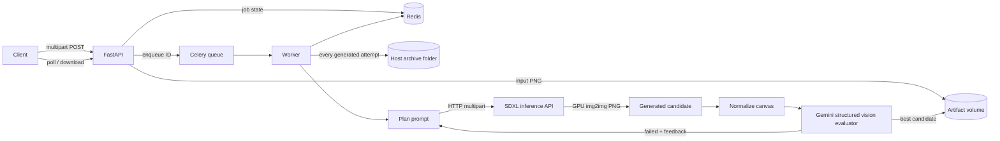

# Creative Variant Service

A containerized FastAPI backend that accepts a marketing creative, recommendations, and brand
guidelines; generates visual variants asynchronously with local SDXL; and uses Gemini vision to
report whether each recommendation was applied and the result remains brand-compliant.

## Architecture



The loop is deliberately bounded. For every requested variant, the worker:

1. converts all recommendations and guidelines into an edit plan;
2. calls the separate SDXL HTTP service, which edits the original on the local NVIDIA GPU;
3. restores the exact original canvas dimensions without geometric stretching;
4. sends the original, candidate, recommendations, and rules to Gemini for structured evaluation;
5. retries from the original with actionable evaluator feedback when either verdict fails; and
6. returns the best-scoring attempt even when the retry budget is exhausted.

Brand compliance is weighted above recommendation strength when selecting the best attempt. Exact
canvas dimensions are checked in code rather than entrusted to a model. Semantic rules such as
“do not alter the face/logo/headphones” are judged against both images.

The Compose profile uses [SSD-1B](https://huggingface.co/segmind/SSD-1B), an Apache-2.0 distilled
SDXL model documented as 50% smaller and about 60% faster than SDXL base. It runs through the same
Diffusers SDXL image-to-image pipeline and fits this machine's 8 GB GPU plus 7 GB Docker-memory
limit. The full [SDXL base 1.0](https://huggingface.co/stabilityai/stable-diffusion-xl-base-1.0)
remains selectable through `SDXL_MODEL_ID` on a larger Docker-memory allocation. VAE tiling follows
Hugging Face's [memory optimization guidance](https://huggingface.co/docs/diffusers/optimization/memory).

## Run

Requirements: Docker with Compose, an NVIDIA GPU, current NVIDIA drivers, and NVIDIA Container
Toolkit support in Docker Desktop.

```bash
docker compose up --build
```

The backend API is at `http://localhost:8000`; interactive documentation is at `/docs`. The SDXL
provider API is separately exposed at `http://localhost:8001`, while the worker reaches it at
`http://sdxl:8001` over the Compose network. The first generation downloads the weights into the
git-ignored `models/` folder and can take several minutes. Later jobs and container rebuilds reuse
that local cache. No API key or per-image payment is required; local electricity and hardware usage
still apply.

Every generated attempt, including retry candidates, is also copied to the git-ignored
`archive/<job-id>/` folder on the host.

Other projects can reuse the same model without downloading it again by mounting
`C:\Users\johan\Documents\ChatGPT\AI Engineer Assignment\models` at `/models` and setting
`HF_HOME=/models` in their inference container.

Add `GEMINI_API_KEY=your-key` to the git-ignored `.env.local` file before submitting jobs. Google
recommends environment variables for API keys; the key is injected only into the worker and is not
baked into an image. OpenAI and offline evaluation remain available as opt-in providers.

## Submit a sample

The fields `recommendations` and `brand_guidelines` are JSON strings in the multipart request.
This example uses the provided `image1` material:

```bash
curl -sS http://localhost:8000/v1/jobs \
  -F image=@creative_1.png \
  --form-string "recommendations=$(jq -c '.image1.recommendations' recommendations.json)" \
  --form-string "brand_guidelines=$(jq -c '.image1.brand_guidelines' brand_guidelines.json)" \
  -F variants=2
```

The service responds immediately with HTTP 202:

```json
{
  "job_id": "4db8c04e-44de-40ff-bb4f-46e1ec4ef55a",
  "status": "queued",
  "status_url": "http://localhost:8000/v1/jobs/4db8c04e-44de-40ff-bb4f-46e1ec4ef55a"
}
```

Poll `status_url`. A completed job contains per-variant `recommendation_checks`,
`guideline_checks`, two independent scores and verdicts, feedback, selected attempt, and a relative
`image_url`. Terminal states are `succeeded`, `partially_succeeded`, and `failed`.

## API contract

### `POST /v1/jobs`

Multipart fields:

| Field | Type | Notes |
|---|---|---|
| `image` | file | Any valid Pillow-readable image, normalized to PNG; 15 MiB default limit |
| `recommendations` | JSON string | Non-empty objects with `id`, `title`, `description`, `type` |
| `brand_guidelines` | JSON string | `protected_regions` plus optional typography/aspect/brand rules |
| `variants` | integer | 1–4 by default |

### `GET /v1/jobs/{job_id}`

Returns current state and results. Internal filesystem paths are not exposed.

### `GET /v1/jobs/{job_id}/variants/{variant_id}/image`

Downloads the selected PNG candidate.

### Health

- `/health/live`: process is alive.
- `/health/ready`: dependencies are reachable (Redis in production).

## Configuration

| Variable | Default | Purpose |
|---|---|---|
| `IMAGE_PROVIDER` | `sdxl` | `sdxl` for local generation or `openai` |
| `EVALUATION_PROVIDER` | `local` (`gemini` in Compose) | Gemini vision, offline proxy, or OpenAI evaluation |
| `GEMINI_API_KEY` | optional | Required when `EVALUATION_PROVIDER=gemini` |
| `GEMINI_MODEL` | `gemini-3.8-flash` | Structured multimodal evaluator |
| `OPENAI_API_KEY` | optional | Required only when either provider is `openai` |
| `IMAGE_MODEL` | `gpt-image-2` | Image editing model |
| `EVALUATION_MODEL` | `gpt-5.5` | Structured vision evaluator |
| `SDXL_API_URL` | `http://sdxl:8001` | Backend-to-SDXL provider endpoint |
| `SDXL_API_TIMEOUT_SECONDS` | `600` | Provider request timeout |
| `SDXL_MODEL_ID` | SDXL base (`segmind/SSD-1B` in Compose) | Hugging Face model |
| `SDXL_STRENGTH` | `0.28` | Edit strength; lower values preserve more source pixels |
| `SDXL_STEPS` | `30` (`20` in Compose) | Denoising steps |
| `SDXL_MAX_EDGE` | `1024` (`768` in Compose) | Maximum working resolution before final normalization |
| `SDXL_CPU_OFFLOAD` | `true` (`false` in Compose) | Move weights between CPU/GPU; disabled in this 7 GB Docker-memory profile |
| `REDIS_URL` | `redis://localhost:6379/0` | Queue and job-state backend |
| `ARTIFACT_ROOT` | `data/jobs` | Shared input/output storage |
| `ARCHIVE_ROOT` | `archive` | Host-visible copy of every generated attempt |
| `MAX_VARIANTS` | `4` | Per-job fan-out guardrail |
| `MAX_GENERATION_ATTEMPTS` | `2` | Bounded critique/revision loop |
| `JOB_TTL_SECONDS` | seven days | Redis record lifetime |
| `MAX_UPLOAD_BYTES` | 15 MiB | Upload guardrail |

## Tests and quality checks

```bash
python -m pip install -e '.[dev]'
ruff check .
pytest
```

The suite uses fakes for generation/evaluation and never makes billable model calls.

## Local-model limitations

- SDXL is not reliable at exact typography or precise copy rewrites. Treat copy-focused variants as
  concepts and composite approved text with a deterministic graphics layer in production.
- The optional local evaluator measures global pixel change and preservation. It cannot prove that a specific
  face, logo, or product region is untouched and explicitly labels that evidence as requiring human
  review. Select `EVALUATION_PROVIDER=openai` or add a local VLM for semantic automated review.
- Lower `SDXL_STRENGTH` when brand assets drift; raise it when variants are too subtle.

## Troubleshooting optional OpenAI mode

- `credit_balance_exhausted` or `insufficient_quota`: add API project credits in
  [OpenAI Platform billing](https://platform.openai.com/settings/organization/billing/). ChatGPT and
  Codex subscriptions are separate from API billing. The worker fails these jobs immediately.
- `rate_limit_exceeded`: the worker retries twice with exponential backoff before failing the job.
- API connection or timeout errors: the same bounded retry policy applies.

## Design tradeoffs and production follow-ups

- Redis is sufficient for an assignment and makes the API stateless. A production system should
  persist job/audit metadata in Postgres and put images in object storage using signed URLs.
- Celery acknowledgement-after-completion and bounded retries tolerate worker loss and transient
  provider failures. Idempotency keys and distributed locks should be added before horizontal scale.
- VLM judgment is useful but not ground truth. A production rollout should maintain a human-rated
  evaluation set, track per-rule precision/recall, calibrate thresholds, and route low-confidence or
  protected-identity cases to human review.
- Prompt-only protection cannot guarantee pixel identity. For strict brand assets, store region
  masks/coordinates and composite protected pixels from the original after generation, then run
  perceptual-hash or LPIPS checks inside each protected mask.
- The final canvas always matches the original dimensions. Since image models may emit a nearby
  supported aspect ratio, center-cropping can remove edge content; production should use explicit
  masks or outpainting when the source ratio is unusual.
- Add authentication, tenant-scoped object keys, content moderation, request idempotency, metrics,
  tracing, provider cost budgets, and scheduled artifact deletion before public deployment.
